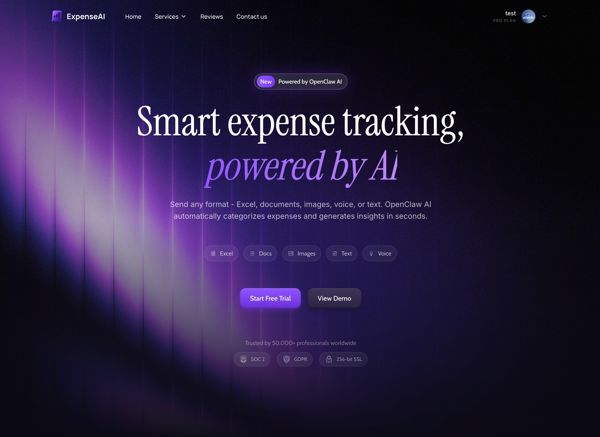
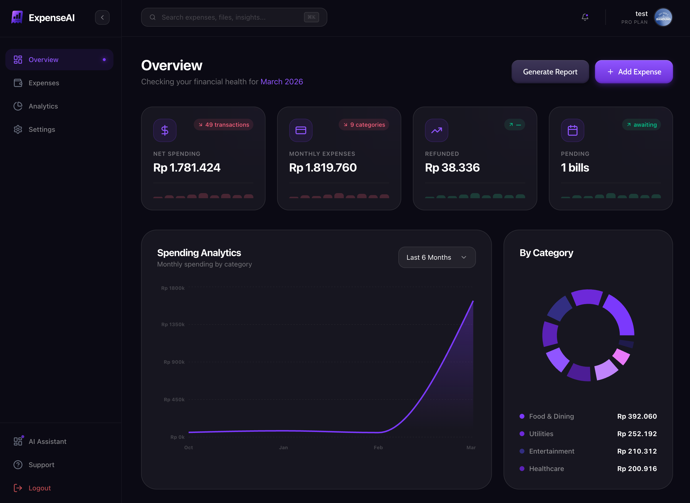
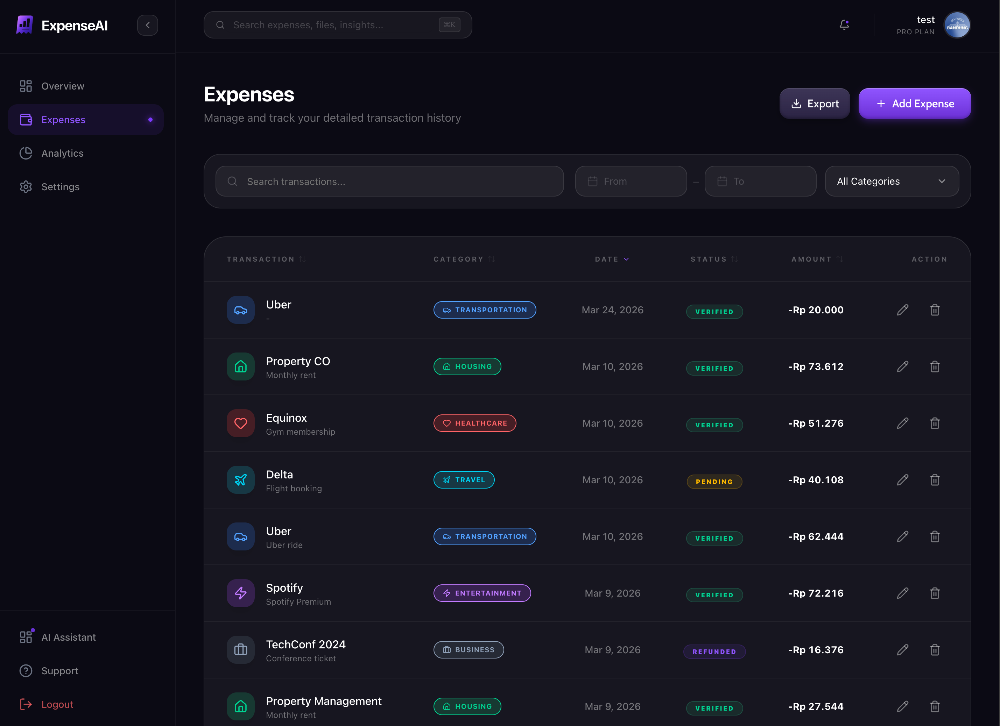
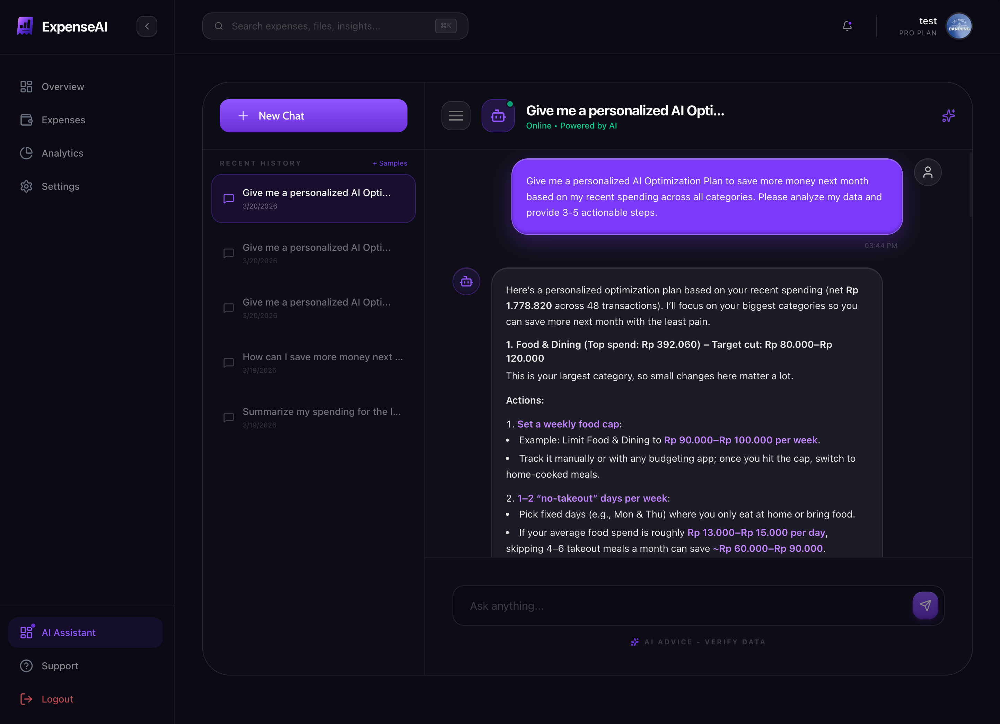

# Expense Tracker

AI-powered expense tracking app built with Next.js + Supabase.



Live app: [https://expense-tracker.zharmedia.xyz/](https://expense-tracker.zharmedia.xyz/)

## Overview
This project helps users track daily expenses, analyze spending trends, and get AI-driven financial guidance in Indonesian Rupiah (IDR).

Core capabilities:
- Email/password auth (Supabase Auth)
- Expense CRUD with filters, search, sort, and pagination
- Analytics dashboard (monthly, category, weekly, peak spending)
- CSV export for transaction data
- AI assistant with persisted chat sessions
- Profile + settings management (including avatar upload)

## Screenshots
### Dashboard Overview


### Expenses Management


### AI Assistant Chat


## Tech Stack
- Next.js 16 (App Router)
- React 19 + TypeScript
- Supabase (Auth + Postgres)
- Tailwind CSS 4
- Framer Motion + Recharts

## Getting Started
### 1. Prerequisites
- Node.js 20+
- pnpm
- Supabase project

### 2. Install dependencies
```bash
pnpm install
```

### 3. Configure environment
Create `.env.local` (or `.env`) with:

```bash
NEXT_PUBLIC_SUPABASE_URL=your_supabase_url
NEXT_PUBLIC_SUPABASE_ANON_KEY=your_supabase_anon_key
SUMOPORT_API_KEY=your_ai_api_key
```

Notes:
- `NEXT_PUBLIC_SUPABASE_URL` and `NEXT_PUBLIC_SUPABASE_ANON_KEY` are required for auth and data access.
- `SUMOPORT_API_KEY` powers `/api/chat`.
- `.env` is already ignored by `.gitignore`.

### 4. Database setup (Supabase)
Create required tables/policies in your Supabase SQL editor.

```sql
-- profiles
create table if not exists public.profiles (
  id uuid primary key references auth.users(id) on delete cascade,
  full_name text,
  avatar_url text,
  company text default '',
  phone text default '',
  email_notifications boolean default true,
  push_notifications boolean default true,
  created_at timestamptz default now(),
  updated_at timestamptz default now()
);

-- expenses
create table if not exists public.expenses (
  id uuid primary key default gen_random_uuid(),
  user_id uuid not null references auth.users(id) on delete cascade,
  description text not null,
  category text not null,
  amount numeric not null,
  expense_date date not null,
  merchant text not null,
  status text not null default 'Completed',
  payment_method text not null default 'Personal Card',
  created_at timestamptz default now(),
  updated_at timestamptz default now()
);

-- chat sessions
create table if not exists public.chat_sessions (
  id uuid primary key default gen_random_uuid(),
  user_id uuid not null references auth.users(id) on delete cascade,
  title text not null default 'New Chat',
  created_at timestamptz default now(),
  updated_at timestamptz default now()
);

-- chat messages
create table if not exists public.chat_messages (
  id uuid primary key default gen_random_uuid(),
  session_id uuid not null references public.chat_sessions(id) on delete cascade,
  role text not null check (role in ('user', 'assistant')),
  content text not null,
  created_at timestamptz default now()
);
```

Minimum RLS policies (owner-only access):

```sql
alter table public.profiles enable row level security;
alter table public.expenses enable row level security;
alter table public.chat_sessions enable row level security;
alter table public.chat_messages enable row level security;

create policy "profiles_owner_all" on public.profiles
for all using (auth.uid() = id) with check (auth.uid() = id);

create policy "expenses_owner_all" on public.expenses
for all using (auth.uid() = user_id) with check (auth.uid() = user_id);

create policy "chat_sessions_owner_all" on public.chat_sessions
for all using (auth.uid() = user_id) with check (auth.uid() = user_id);

create policy "chat_messages_owner_all" on public.chat_messages
for all using (
  exists (
    select 1 from public.chat_sessions s
    where s.id = chat_messages.session_id and s.user_id = auth.uid()
  )
) with check (
  exists (
    select 1 from public.chat_sessions s
    where s.id = chat_messages.session_id and s.user_id = auth.uid()
  )
);
```

Project migration included:
- `supabase/migrations/20240319000000_extend_profiles.sql`

### 5. Run locally
```bash
pnpm dev
```

Open [http://localhost:3000](http://localhost:3000).

## Scripts
- `pnpm dev` - start dev server
- `pnpm build` - production build
- `pnpm start` - run production server
- `pnpm lint` - run ESLint
- `pnpm generate:assets` - generate visual assets (requires `SUMOPORT_API_KEY`)

## App Routes
- `/` - landing page
- `/login` `/register` - auth
- `/dashboard` - overview
- `/dashboard/expenses` - transaction management
- `/dashboard/analytics` - spending analytics
- `/dashboard/chat` - AI assistant + chat history
- `/dashboard/settings` - profile/preferences
- `/support` - support center

## API Routes
- `/api/expenses` + `/api/expenses/[id]`
- `/api/expenses/analytics`
- `/api/profile` + `/api/profile/avatar`
- `/api/chat`
- `/api/chat/sessions` and nested message/session endpoints

## GitHub Description
Suggested repository description:

`AI-powered expense tracker built with Next.js and Supabase, featuring analytics dashboards, CSV export, and an intelligent financial assistant.`
